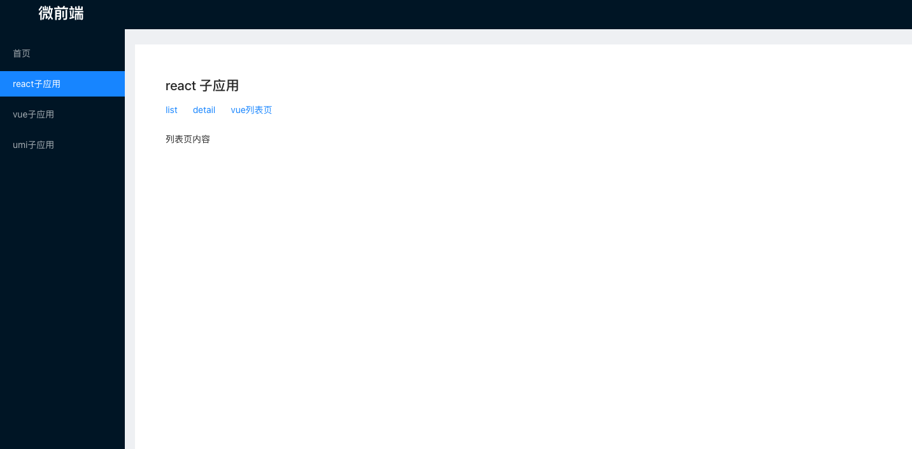

# 基于Pnpm + Turborepo + QianKun的微服务+Monorepo实践

## 背景

微前端一般都会涉及多个代码库，很多时候要一个一个代码库地去开发维护和运行，很不方便，这种时候引入Monorepo搭配微前端就能很好地解决这种问题，一个代码库就可以完成整个微前端项目的维护，同时基于Monorepo的版本管理也有成熟的方案。

个人观点：一般是要兼容新旧项目的时候，提供一套插拔机制，在保证新功能可以使用新技术栈的同时，兼容旧项目平稳运行，这种时候使用微前端就比较合适，不然强行使用微前端的话，就是强行增加开发难度和心智损耗。


## 创建Turborepo项目

```
pnpm dlx create-turbo@latest
or 
npx create-turbo@latest
```

第一步给项目命名，例如`turbo-qiankun-project`，第二步选Pnpm，其它的可一路回车。


## 项目整体结构

整个的turbo项目结构大致如下。

```less
├── turbo-qiankun-project 
├─── apps     // 应用代码存放目录
├──── micro-base     // 基座
├──── sub-react       // react子应用，create-react-app创建的react应用，使用webpack打包
├──── sub-vue  // vue子应用，vite创建的子应用
├──── sub-umi    // umi脚手架创建的子应用
├─── packages // 公共库代码存放目录
└─── package.json   
```

现统一在apps文件夹里创建微前端应用，主要是以下几个部分。

```less
├── micro-base     // 基座
├── sub-react       // react子应用，create-react-app创建的react应用，使用webpack打包
├── sub-vue  // vue子应用，vite创建的子应用
└── sub-umi    // umi脚手架创建的子应用
```

- 基座（主应用）：主要负责集成所有的子应用，提供一个入口能够访问你所需要的子应用的展示，尽量不写复杂的业务逻辑
- 子应用：根据不同业务划分的模块，每个子应用都打包成`umd`模块的形式供基座（主应用）来加载


## 创建基架应用

### 非umi的基架应用

基座用的是`create-react-app`脚手架加上`antd`组件库搭建的项目，也可以选择vue或者其他框架。

- 创建项目:`npx create-react-app micro-base`
- 打开项目: `cd micro-base`
- 启动项目:`npm start`
- 暴露配置项（可选）:`npm run eject`

以上就是一些常规的react项目创建的步骤，接下来开始引入Qiankun。

1. 安装qiankun

```bash
pnpm i qiankun
```

2. 修改入口文件

```javascript
// 在src/index.tsx中增加如下代码
import { start, registerMicroApps } from 'qiankun';

// 1. 要加载的子应用列表
const apps = [
  {
    name: "sub-react", // 子应用的名称
    entry: '//localhost:8080', // 默认会加载这个路径下的html，解析里面的js
    activeRule: "/sub-react", // 匹配的路由
    container: "#sub-app" // 加载的容器
  },
]

// 2. 注册子应用
registerMicroApps(apps, {
  beforeLoad: [async app => console.log('before load', app.name)],
  beforeMount: [async app => console.log('before mount', app.name)],
  afterMount: [async app => console.log('after mount', app.name)],
})

start() // 3. 启动微服务
```

当微应用信息注册完之后，一旦浏览器的 url 发生变化，便会自动触发 qiankun 的匹配逻辑，所有 activeRule 规则匹配上的微应用就会被插入到指定的 container 中，同时依次调用微应用暴露出的生命周期钩子。

主要用到的两个API：

- registerMicroApps(apps, lifeCycles?)

  注册所有子应用，qiankun会根据activeRule去匹配对应的子应用并加载

- start(options?)

  启动 qiankun，可以进行预加载和沙箱设置

至此基座就改造完成，如果是老项目或者其他框架的项目想改成微前端的方式也是类似。


### 基于umi的基架应用

1.创建项目

1.安装插件`plugin-qiankun`

```
pnpm i @umijs/plugin-qiankun -D
```

2.配置.umirc.ts

```js
defineConfig({
  ...... ,
  qiankun: {
    master: {
      // 注册子应用信息
      apps: [
        {
          name: 'app1', // 唯一 id
          entry: '//localhost:7001', // html entry
        },
        {
          name: 'app2', // 唯一 id
          entry: '//localhost:7002', // html entry
        },
      ],
    },
  },
});

```

3.app.js 文件配置

以下详细配置可写在app.ts 文件中作为在.umirc.ts 文件中注册之后的补充

在app.ts中补充的原因：.umirc.ts 文件中注册时不能使用props传递参数

```js
import { SUB_REACT, SUB_REACT_SECOND } from "@/utils/proxy";
// 子应用传递参数使用
export const qiankun = {
    master: {
      // 注册子应用信息
      apps: [
        {
          entry: SUB_REACT, // html entry
          name: "reactApp", // 子应用名称
          container: "#subapp", // 子应用挂载的 div
          activeRule: "/sub-react",
          props: {
            // 子应用传值
            msg: {
              data: {
                mt: "you are one",
              },
            },
            historyMain: (value:any) => {
              history.push(value);
            },
          },
        },
        {
          entry: SUB_REACT_SECOND, // html entry
          name: "reactAppSecond",
          container: "#subapp", // 子应用挂载的div
          activeRule: "/sec_sub",
           props: {
            // 子应用传值
            msg: {
              data: {
                mt: "you are one",
              },
            },
            historyMain: (value:any) => {
              history.push(value);
            },
          },
        },
      ],
    },
  }

```

4.router.js 文件配置

```js
  {
      title: "sub-react",
      path: "/sub-react",
      component: "../layout/index.js",
      routes: [
        {
          title: "sub-react",
          path: "/sub-react",
          microApp: "reactApp",
          microAppProps: {
            autoSetLoading: true, // 开启子应用loading
            // className: "reactAppSecond", // 子应用包裹元素类名
            // wrapperClassName: "myWrapper",
          },
        },
      ],
    },
    {
      title: "sec_sub",
      path: "/sec_sub",
      component: "../layout/index.js",
      routes: [
        {
          title: "sec_sub",
          path: "/sec_sub",
          microApp: "reactAppSecond",
          microAppProps: {
            autoSetLoading: true, // 开启子应用loading
            // className: "reactAppSecond",
            // wrapperClassName: "myWrapper",
          },
        },
      ],
    },

```

5.父应用配置生命周期钩子

在父应用的 `src/app.ts` 中导出 `qiankun` 对象进行全局配置，所有的子应用都将实现这些生命周期钩子：

```js
// src/app.ts
export const qiankun = {
  lifeCycles: {
    // 所有子应用在挂载完成时，打印 props 信息
    async afterMount(props) {
      console.log(props);
    },
  },
};
```


## React子应用

### 创建子应用

使用`create-react-app`脚手架创建，`webpack`进行配置，为了不eject所有的webpack配置，可以选择用`react-app-rewired`工具来改造webpack配置。

```bush
pnpm i react-app-rewired customize-cra -D
```

### 改造子应用

1.在src目录新增文件`public-path.js`

```js
if (window.__POWERED_BY_QIANKUN__) {
  // 动态设置 webpack publicPath，防止资源加载出错
  // eslint-disable-next-line no-undef
  __webpack_public_path__ = window.__INJECTED_PUBLIC_PATH_BY_QIANKUN__
}
```

2.修改webpack配置文件

在根目录下新增`config-overrides.js`文件，并新增如下配置

```js
const { name } = require('./package');

module.exports = {
  webpack: (config) => {
    config.output.library = `${name}-[name]`;
    config.output.libraryTarget = 'umd';
    // webpack 5 需要把 jsonpFunction 替换成 chunkLoadingGlobal
    config.output.jsonpFunction = `webpackJsonp_${name}`; 
    config.output.globalObject = 'window';

    return config;
  },

  devServer: (_) => {
    const config = _;

    config.headers = {
      'Access-Control-Allow-Origin': '*',
    };
    config.historyApiFallback = true;
    config.hot = false;
    config.watchContentBase = false;
    config.liveReload = false;

    return config;
  },
};
```


3.修改`package.json`文件

```
{
  // ...
  "scripts": {
    "start": "react-app-rewired start",
    "build": "react-app-rewired build",
    "test": "react-app-rewired test",
    "eject": "react-scripts eject"
  },
  // ...
}
```

4.改造主入口`index.js`文件

```jsx
import React from "react";
import ReactDOM from "react-dom";
import "./index.css";
import App from "./App";
import Main from "./Main";
import Home from "./Home";
import reportWebVitals from "./reportWebVitals";
import { BrowserRouter, Switch, Route, Redirect } from "react-router-dom";
import "./public-path.js";

let root;

// 将render方法用函数包裹，供后续主应用与独立运行调用
function render(props) {
  const { container } = props;
  const dom = container ? container.querySelector('#root') : document.getElementById('root')
  root = createRoot(dom)
  root.render(
    <BrowserRouter
      basename={
        window.__POWERED_BY_QIANKUN__ ? "/sub-react" : "/sub-react"
      }
    >
      <Switch>
        <Route
          path="/"
          exact
          render={(propsAPP) => <App {...propsAPP} propsMainAPP={props} />}
        ></Route>
        <Route
          path="/main"
          exact
          render={(propsAPP) => <Main {...propsAPP} propsMainAPP={props} />}
        ></Route>
        <Route path="/home" exact component={Home}></Route>
        {/* 子应用一定不能写，否则会出现路由跳转bug */}
        {/* <Redirect from="*" to="/"></Redirect> */}
      </Switch>
    </BrowserRouter>
	);
}

// 判断是否在qiankun环境下，非qiankun环境下独立运行
if (!window.__POWERED_BY_QIANKUN__) {
  console.log("独立运行时");
  render({});
}

// 各个生命周期
// bootstrap 只会在微应用初始化的时候调用一次，下次微应用重新进入时会直接调用 mount 钩子，不会再重复触发 bootstrap。
export async function bootstrap() {
  console.log("[react16] react app bootstraped");
}

// 应用每次进入都会调用 mount 方法，通常我们在这里触发应用的渲染方法
export async function mount(props) {
  // props.onGlobalStateChange((state, prev) => {
  //   // state: 变更后的状态; prev 变更前的状态
  //   console.log(state, prev);
  // });
  // props.setGlobalState({ username: "11111", password: "22222" });
  // console.log("[react16] props from main framework", props);
  // console.log(props.singleSpa.getAppStatus());
  render(props);
}

// 应用每次 切出/卸载 会调用的方法，通常在这里我们会卸载微应用的应用实例
export async function unmount(props) {
  const { container } = props;
  root.unmount();
}
reportWebVitals();
```

通过上面几步，即可完成React子应用的改造。


## Vite + Vue3子应用

### 创建子应用

选择vue3+vite

```
pnpm create vite@latest
```

### 改造子应用

1.安装`qiankun`依赖

```
pnpm i vite-plugin-qiankun
```

2.修改`vite.config.js`

```js
import qiankun from 'vite-plugin-qiankun';

defineConfig({
    base: '/sub-vue', // 和基座中配置的activeRule一致
    server: {
      port: 3002,
      cors: true,
      origin: 'http://localhost:3002'
    },
    plugins: [
      vue(),
      qiankun('sub-vue', { // 配置qiankun插件
        useDevMode: true
      })
    ]
})
```

3.修改`main.js`

```js
import { createApp } from 'vue'
import './style.css'
import App from './App.vue'
import { renderWithQiankun, qiankunWindow } from 'vite-plugin-qiankun/dist/helper';

let app;
if (!qiankunWindow.__POWERED_BY_QIANKUN__) {
  createApp(App).mount('#app');
} else {
  renderWithQiankun({
    // 子应用挂载
    mount(props) {
      app = createApp(App);
      app.mount(props.container.querySelector('#app'));
    },
    // 只有子应用第一次加载会触发
    bootstrap() {
      console.log('vue app bootstrap');
    },
    // 更新
    update() {
      console.log('vue app update');
    },
    // 卸载
    unmount() {
      console.log('vue app unmount');
      app && app.unmount();
    }
  });
}
```


## umi子应用

### 创建子应用

使用最新的umi4去创建子应用，创建好后只需要简单的配置就可以跑起来。

```
pnpm dlx create-umi@latest
```


### 改造子应用

1.安装插件

```
pnpm i @umijs/plugins
```

2.配置`.umirc.ts`

```js
export default {
  base: '/sub-umi',
  // plugins: ['@umijs/plugins/dist/qiankun'],
  qiankun: {
    slave: {},
  }
};
```

完成上面两步就可以在基座中看到umi子应用的加载了。

3.修改入口文件

如果想在qiankun的生命周期中做些处理，需要修改下入口文件，在子应用的 `src/app.ts` 中导出 `qiankun` 对象，实现生命周期钩子。子应用运行时仅支持配置 `bootstrap`、`mount` 和 `unmount` 钩子：

```js
// src/app.ts
export const qiankun = {
  // 应用加载之前
  async bootstrap(props) {
    console.log('app1 bootstrap', props);
  },
  // 应用 render 之前触发
  async mount(props) {
    console.log('app1 mount', props);
  },
  // 应用卸载之后触发
  async unmount(props) {
    console.log('app1 unmount', props);
  },
};
```


# 注意点

## 样式隔离

qiankun实现了各个子应用之间的样式隔离，但是基座和子应用之间的样式隔离没有实现，所以基座和子应用之前的样式还会有冲突和覆盖的情况。

解决方法：

- 每个应用的样式使用固定的格式
- 通过`css-module`的方式给每个应用自动加上前缀


## 子应用间的跳转

- 主应用和微应用都是 `hash` 模式，主应用根据 `hash` 来判断微应用，则不用考虑这个问题。
- `history`模式下微应用之间的跳转，或者微应用跳主应用页面，直接使用微应用的路由实例是不行的，原因是微应用的路由实例跳转都基于路由的 `base`。有两种办法可以跳转：
  1. history.pushState()
  2. 将主应用的路由实例通过 `props` 传给微应用，微应用这个路由实例跳转。

具体方案：在基座中复写并监听`history.pushState()`方法并做相应的跳转逻辑

```js
// 重写函数
const _wr = function (type: string) {
  const orig = (window as any).history[type]
  return function () {
    const rv = orig.apply(this, arguments)
    const e: any = new Event(type)
    e.arguments = arguments
    window.dispatchEvent(e)
    return rv
  }
}

window.history.pushState = _wr('pushState')

// 在这个函数中做跳转后的逻辑
const bindHistory = () => {
  const currentPath = window.location.pathname;
  setSelectedPath(
  	routes.find(item => currentPath.includes(item.key))?.key || ''
  )
}

// 绑定事件
window.addEventListener('pushState', bindHistory)
```


## 公共依赖加载

场景：如果主应用和子应用都使用了相同的库或者包(antd, axios等)，就可以用`externals`的方式来引入，减少加载重复包导致资源浪费，就是一个项目使用后另一个项目不必再重复加载。

方式：

- 主应用：将所有公共依赖配置`webpack` 的`externals`，并且在`index.html`使用外链引入这些公共依赖

- 子应用：和主应用一样配置`webpack` 的`externals`，并且在`index.html`使用外链引入这些公共依赖，注意，还需要给子应用的公共依赖的加上 `ignore` 属性（这是自定义的属性，非标准属性），qiankun在解析时如果发现`igonre`属性就会自动忽略

以axios为例：

```js
// 修改config-overrides.js
const { override, addWebpackExternals } = require('customize-cra')

module.exports = override(
  addWebpackExternals ({
    axios: "axios",
  }),
)
```

```html
<!-- 注意：这里的公共依赖的版本必须一致 -->
<script ignore="true" src="https://unpkg.com/axios@1.1.2/dist/axios.min.js"></script>
```


## 全局状态管理

一般来说，各个子应用是通过业务来划分的，不同业务线应该降低耦合度，尽量去避免通信，但是如果涉及到一些公共的状态或者操作，qiankun也是支持的。

qinkun提供了一个全局的`GlobalState`来共享数据，基座初始化之后，子应用可以监听到这个数据的变化，也能提交这个数据。

基座：

```js
// 基座初始化
import { initGlobalState } from 'qiankun';
const actions = initGlobalState(state);
// 主项目项目监听和修改
actions.onGlobalStateChange((state, prev) => {
  // state: 变更后的状态; prev 变更前的状态
  console.log(state, prev);
});
actions.setGlobalState(state);
```

子应用：

```js
// 子项目监听和修改
export function mount(props) {
  props.onGlobalStateChange((state, prev) => {
    // state: 变更后的状态; prev 变更前的状态
    console.log(state, prev);
  });
  props.setGlobalState(state);
}
```


## 父子应用通信

一种方法是使用`GlobalState`。

如果是使用umi，还有两种方式：

- 基于 `useModel()` 的通信。这是 Umi **推荐**的解决方案。
- 基于配置的通信。

具体可在Umi官网查阅。


# 项目代码地址

https://github.com/brucecat/turbo-qiankun-template




# 参考文章

《打造高效Monorepo：Turborepo、pnpm、Changesets实践》https://tech.uupt.com/?p=1185

《Qiankun官网》https://qiankun.umijs.org/zh/guide/tutorial#umi-qiankun-%E9%A1%B9%E7%9B%AE

《Umi官网》https://umijs.org/docs/max/micro-frontend

《用微前端 qiankun 接入十几个子应用后，我遇到了这些问题》https://juejin.cn/post/7202108772924325949#heading-5